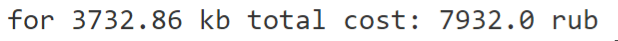

# NetFlow Protocol



```
.
├── img\
├── report\
├── clean_data.csv
└── netTariffingInOutGraph.py
```
### Description
Программа для тарификации абонентов с помощью файла со статистикой IP-трафика в формате NetFlow.
Так как итоговый объем траффика меньше заявленного, еденица измерения - Кб 

### Run
Для запуска программы необходим:
- Python3 с библиотекой `matplotlib`
```
pip install matplotlib
```

### Input/Output files
Файл с трафиком NetFlow преобразован в csv файл для простоты работы

По умолчанию программа будет искать файл с NetFlow как `clean_data.csv`.

На графике красным цветом показана отдача, синим - прием
